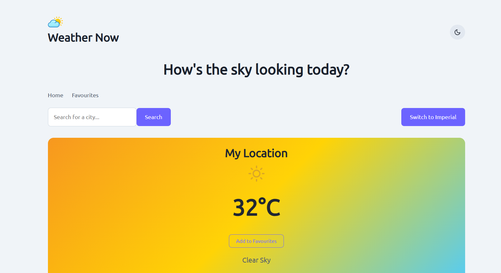
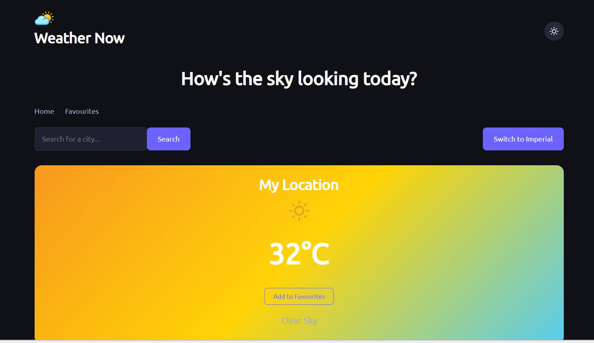
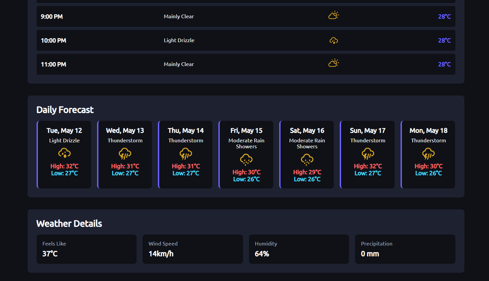
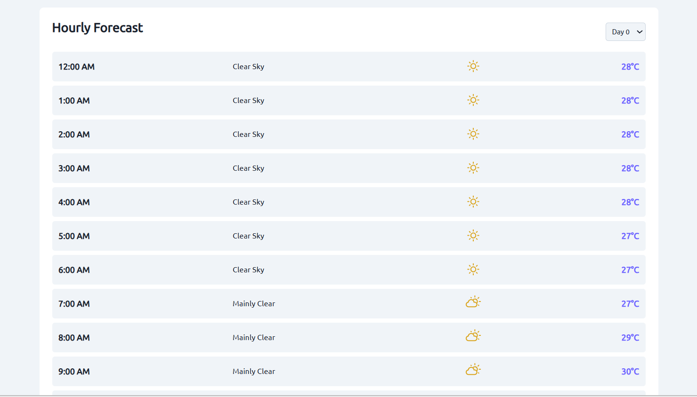

# 🌤️ Weather Now

A responsive weather dashboard built with React and the Open-Meteo API. Search any city, get real-time weather data, save your favourite locations, and switch between light and dark themes.

🔗 **Live Demo:** [weather-now-ott.vercel.app](https://weather-now-ott.vercel.app/)

---

## 📸 Screenshots

### ☀️ Light Mode


### 🌙 Dark Mode


### 📅 Daily Forecast & Weather Details


### 🕐 Hourly Forecast


---

## ✨ Features

| Feature | Description |
|---------|------------|
| 🔍 City Search | Search weather by city name |
| 📍 Geolocation | Auto-detects your location on first visit |
| 🌡️ Current Weather | Temperature, weather icon, and condition |
| 💨 Weather Details | Feels like, wind speed, humidity, precipitation |
| 📆 7-Day Forecast | Daily high/low temperatures with weather icons |
| 🕒 Hourly Forecast | Hour-by-hour breakdown with day selector |
| ⭐ Favourites | Save and manage favourite cities (localStorage) |
| 🔄 Unit Toggle | Switch between Metric (°C, km/h) and Imperial (°F, mph) |
| 🌗 Theme Toggle | Dark/light mode (persisted in localStorage) |
| 🎨 Dynamic Gradients | Weather card background changes based on conditions |
| 💀 Skeleton Loading | Animated loading placeholders |
| 📱 Responsive | Works on desktop, tablet, and mobile |

---

## 🛠️ Tech Stack

| Tool | Purpose |
|------|---------|
| ⚛️ React 18 | UI framework |
| ⚡ Vite | Build tool |
| 🧭 React Router DOM | Client-side routing |
| 🧠 Context API | Global state (ThemeContext, UnitContext) |
| 🌐 Open-Meteo API | Weather data (free, no key required) |
| 🎯 react-icons | Weather Icons + Feather Icons |
| 🚀 Vercel | Deployment |

---

## 🚀 Getting Started

```bash
git clone https://github.com/ott-tech/weather-now.git
cd weather-now
npm install
npm run dev
```

Open `http://localhost:5173` in your browser.

---

## 📁 Project Structure

```
src/
├── components/
│   ├── CurrentWeather.jsx
│   ├── DailyForecast.jsx
│   ├── HourlyForecast.jsx
│   ├── WeatherDetails.jsx
│   ├── SearchBar.jsx
│   ├── Favourites.jsx
│   ├── Skeleton.jsx
│   ├── ThemeToggle.jsx
│   └── UnitToggle.jsx
├── Context/
│   ├── ThemeContext.jsx
│   └── UnitContext.jsx
├── hooks/
│   └── useWeather.js
├── utils/
│   ├── api.js
│   └── helpers.js
├── App.jsx
├── main.jsx
└── index.css
```

---

## 👨‍💻 Author

Built with ❤️ by **ott** as part of the 30 Days of React learning journey.

⭐ Star this repo if you found it useful!
